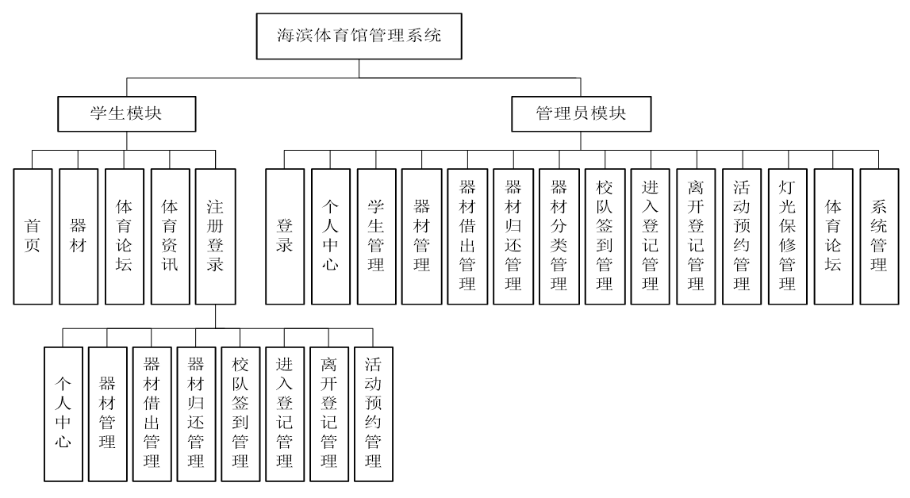
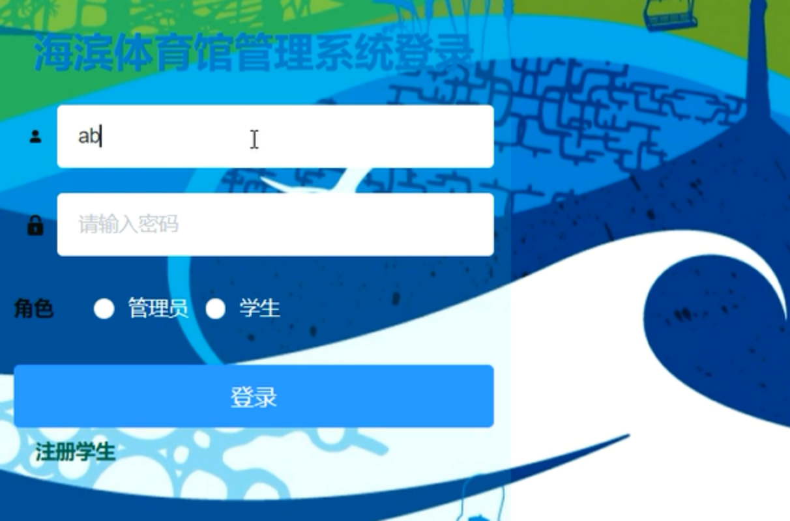
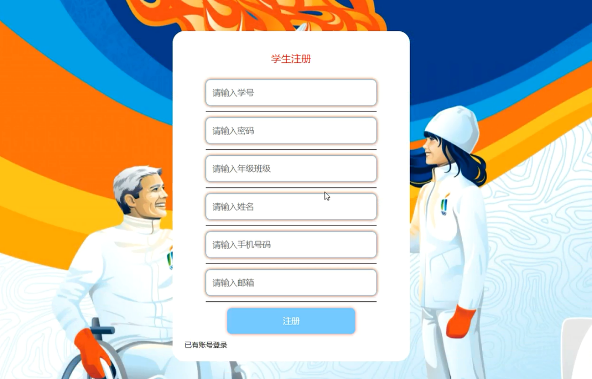
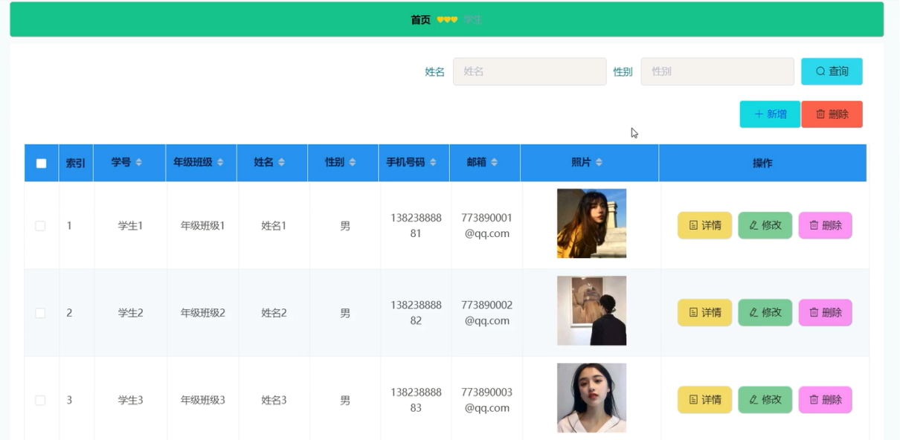
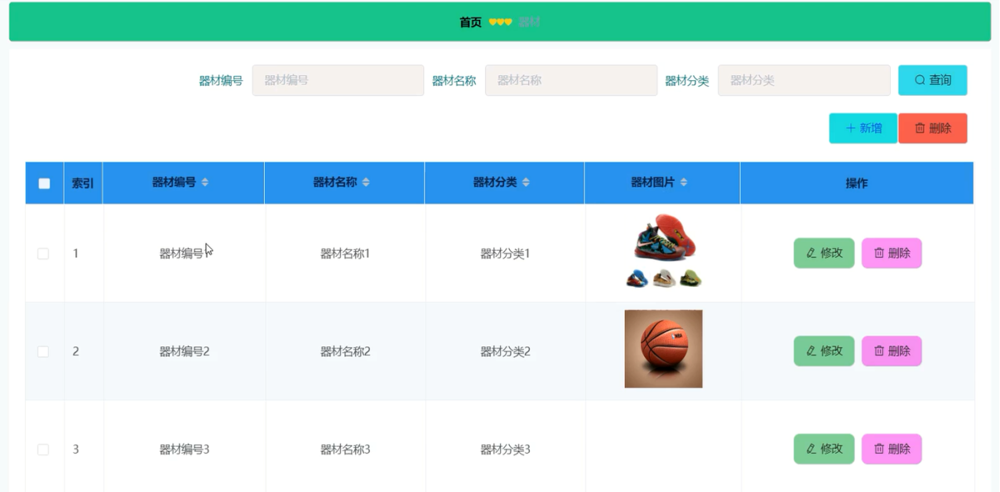
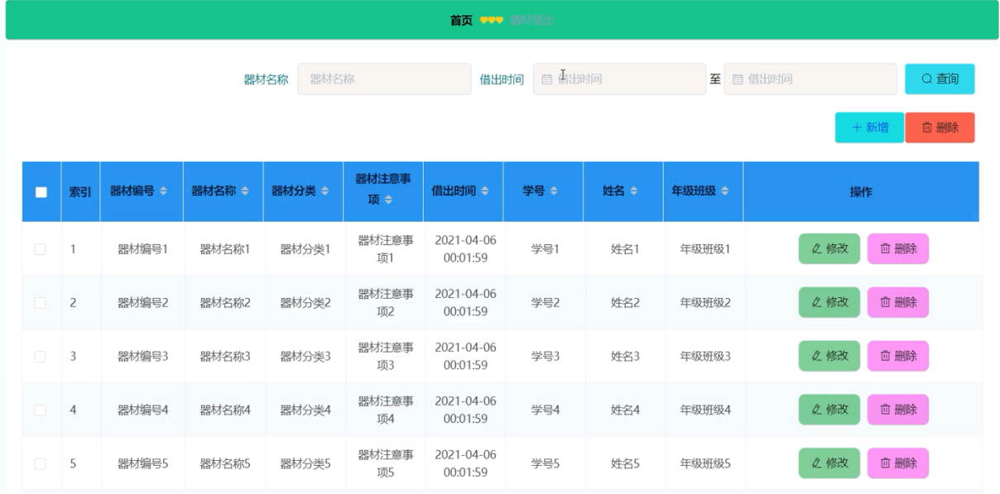
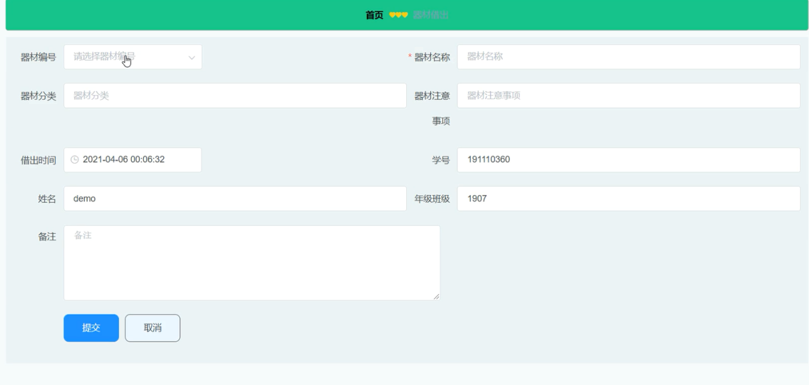
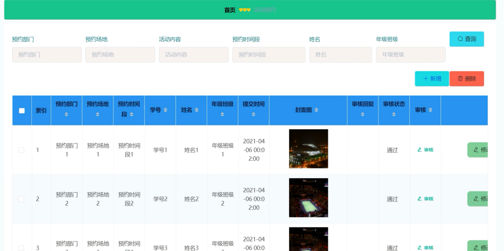
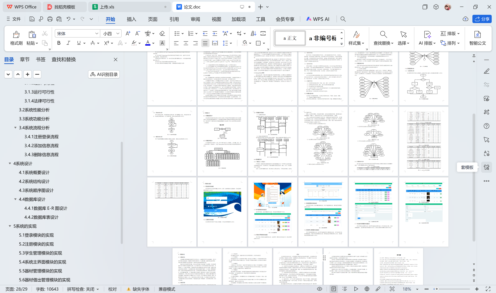

# springboot036-海滨体育馆管理系统的设计与实现

>  博主介绍：
>  Hey，我是程序员Chaers，一个专注于计算机领域的程序员
>  十年大厂程序员全栈开发‍ 日常分享项目经验 解决技术难题与技术推荐 承接各类网站设计，小程序开发，毕设等。
>  【计算机专业课程设计，毕业设计项目，Java，微信小程序，安卓APP都可以做，不仅仅是计算机专业，其它专业都可以】

## 3000套系统可挑选，获取链接：https://chaerspol.github.io/

<b>QQ【获取完整源码】：674456564</b>

<b>QQ群【获取完整源码】：1058861570</b>

### 系统架构

> 前端：html | js | css | jquery | vue
>
> 后端：springboot | mybatis
> 
> 环境：jdk1.8+ | mysql | maven

# 一、内容包括
包括有  项目源码+项目论文+数据库源码+答辩ppt+远程调试成功

# 二、运行环境

> jdk版本：1.8 及以上； ide工具：IDEA； 数据库: mysql5.7及以上；编程语言: Java

# 三、需求分析

**3.1可行性分析**

在进行可行性分析时，我们通常根据软件工程里方法，通过四个方面来进行分析，分别是技术、经济、运行和法律可行性。因此，在基于对目标系统的基本调查和研究后，对提出的基本方案进行可行性分析

**3.1.1技术可行性**

技术可行性一是考虑客观的技术可行性，二是考虑实际的技术可行性。从客观上、简单地说，现已经出现了类似的系统，因此客观上的可行性是满足的。从现有的实际情况上来看，该系统使用的是JAVA开发语言、MYSQL都是容易获得的，同时计算机的硬件性能也满足开发软件的需求；且在本科课程中都有进行相关软件的学习和开发。综上所述，该系统具有技术可行性。

**3.1.2经济可行性**

开发该系统时，优先考虑了使用网页来完成该系统。从已有的Web网页开发的案例、资料中，可知Web所需要的软硬件简单，切开发成本低。且从引进该系统后的预想表现将会比传统方式优异，其具有高效、低成本的特点。可以大量节省管理的人力、物力，具有一定经济效益和社会效益。综上所述，该系统具有高经济可行性

**3.1.3运行可行性**

运行可行性是对组织结构的影响，现有人员和机构和环境对系统的适应性及人员培训补充计划的可行性。以目前信息技术的普及程度之广、相关工作的操作人员的水平之高，是足以胜任的。综上所述，该系统具有高运行可行性。

**3.1.4法律可行性**

（1）所使用的技术或者资料（书籍、文献、软件）合乎中国法律。

（2）所开发过程不涉合同、侵权、责任和各种法律相抵的问题。

（3）所完成系统不存在侵犯版权问题。

（4）完全符合中国的《中华人民共和国著作权法》和《计算机软件保护条例》。

综上所述，该系统具有高法律可行性。
通过分析论证，该系统总体上是具有高可行性的。

**3.2系统性能分析**

达到如以下的性能需求指标，可以保证系统的安全性、可靠性、稳定性，需要：

（1）系统响应的精确性和实时性

这是本系统必要的性能。考虑到未来系统可能承受的工作量，需要能够承担得起企业级的信息处理需求。实时性是该系统的生命线，因此需采用软实时系统来进行保证。

（2）系统的开放性和系统的可扩充性

本系统是一个较为初期的一个雏形，以后势必会根据的海滨体育馆管理需求的扩大或转变。这就要求本系统需要提供足够的开放型和可扩充性，只要符合本系统的设计准则都可以将新的模块加入。通过这样的升级、维护来完成本系统后期的生命周期。

（3）系统的易用性和易维护性

开发的系统要求不论是熟悉或不熟悉计算机的人员都可以对系统进行有效的人机交互。因此提供给用户一个友好、漂亮的图形接口是非常重要的。这可以通过发一些纸质和实际的界面模型问卷调查来获得最佳的效果。此外，也考虑到维护本系统的操作人员，有效的手段的数据备份、管理和错误检测、恢复需要被提供给相关的人员。

（4）系统的响应速度

要求系统在任何情况下的平均响应速度达到秒级，具有软实时性。一是为了保证了系统的工作效率，二为了防止系统因同一时间段大量的用户登录系统而造成错误、瘫痪。

# 四、功能模块

在系统结构设计过程中，首先，整个系统分成几个小的模块，小的问题，然后，进一步细分模块，添加细节。本基于Spring Boot的海滨体育馆管理系统结构图如图所示。

# 五、部分效果图展示

图5-1 系统登录界面图【管理员和学生在登录界面输入用户名、密码，选择类型进行登录操作，系统登录界面展示如图】

图5-2 学生注册界面【没有账号的学生用户可进行注册操作，学生注册界面如图】

图5-3 学生管理界面【管理员可添加、修改和删除学生信息，学生管理界面如图】

图5-4 系统主界面【学生可进入系统前台查看系统信息，包括首页、器材以及体育论坛等，系统主界面如图】

图5-5 器材管理界面【管理员可以添加、修改和删除器材信息，学生可查看器材信息，器材管理界面展示如图】

图5-6 器材借出管理界面【学生可添加器材借出信息，管理员可查看管理所有器材借出信息，并可对其进行修改和删除操作，同时也可添加器材借出信息，器材借出管理界面如图】

图5-7 添加器材借出界面【添加器材借出界面展示如图】

图5-8 活动预约管理界面【学生可添加活动预约信息，管理员可查看活动预约信息，并可对其进行审核、修改和删除操作，活动预约管理界面如图】

 <b>完整文章</b>

 

## 3000套系统可挑选，获取链接：https://chaerspol.github.io/

<b>QQ【获取完整源码】：674456564</b>

<b>QQ群【获取完整源码】：1058861570</b>

